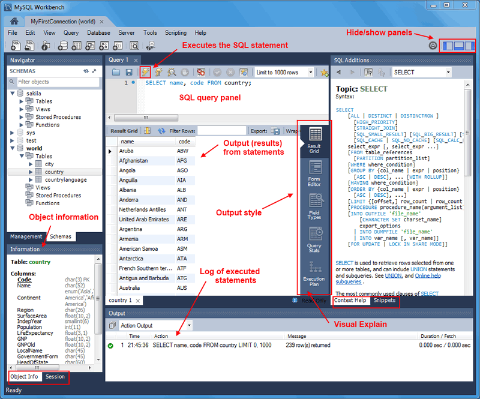

# MySQL with workbench

#### The three modules of workbench

+ SQL Development
+ Data Modeling
+ Migration Wizard

### SQL Development

+ create  a new connection by using Make connections
+ We can perform sql queries in SQL Query Panel we wil see different work areas

### Data Modeling

+ crete data model by using ant database

##### Database
+ Database is a collection of data.It supports the storage and manipulationof the data that you've stored

##### Database Managment System(DBMS)
+ A collection of programs which enables users to access database, manipulate data, and represent data

+ Types of DBMS 
    + Hierchical DBMS 
        + Parent-child relationship of storing data
        + It has a strucutre like tree with node representing records and branches representing fields
    + Network DBMS
        + Mainly support many-to many relationships.So this suallty results in complex database strucutre 
    + Relational DBMS
        + This type of DBMS defines database relationships inform of tables,also known as relations
    + Object_Oriented DBMS
        + This type supports storage of new data types
        + The data to be stored is in form of objects

### Structured Query Language(SQL)
+ A standardized programming language which is used for managing relational databases
+ With SQL, you can modify databases
+ Relational databases like MYSQL Databases, Oracle,Ms SQL Server, Sybase etc use SQL

# MYSQL

+ An open-source software
+ Provides multi-user access
+ Supports-multi storage engines
+ Works on many platforms

##### Features of MYSQL
+ Ease of Management
+ Robust Transactional Support
+ Comprehensive Application Development
+ High Performance
+ Low Total Cost Of Ownership
+ Open Source & 24*7 Support
+ Scalability & Flexibility

### SQL Command Categories

+ Data Definition Language(DDL)
    + Commands used to define the database schema
    + CREATE, DROP, ALTER, TRUNCATE, COMMENT, RENAME

+ Data Manipulation Language(DML)
    + commands deals with manipulation of data present in database
    + SELECT,INSERT, UPDATE, DELETE

+ Data Control Language(DCL)
    + commnds mainly deals with the rights, permissions and other controls of the datbase system
    + GRANT,INVOKE

+ Transaction Control Language(TCL)
    + commands whcih mainly deals with the transaction of database
    + COMMIT, ROLLBACK, SAVEPOINT, SET TRANSACTION

+ Referance Link

[MYSQL](https://www.youtube.com/watch?v=WmGgxTpGs_8)